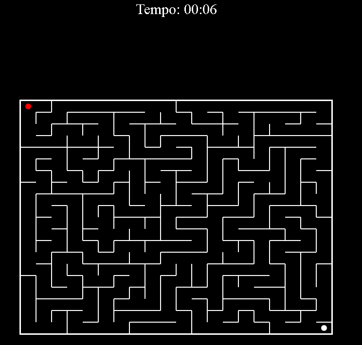

# jogo do labirinto (maze game)
Projeto de estrutura de dados - Labirinto em JavaScript

## Integrantes

| Nome                                   | RA         |
|----------------------------------------|------------|
| Heidielton Carmo de Brito              | 1272022645 |
| Paulo Sérgio Moraes de Oliveira Filho  | 1272022847 |
| Gabriel Alexandria Santana             | 21272018696|
| MATHEUS ALCÂNTARA MARTINS              |1272018579  |

## 1. Descrição do Problema:

O problema consiste em criar um jogo de labirinto onde o jogador precisa encontrar a saída através de um caminho complexo e cheio de obstáculos. O labirinto é representado por uma matriz bidimensional, onde cada célula pode ser um caminho livre, uma parede ou a saída.

## 2. Solução Proposta:

Para resolver este problema, foram implementadas as seguintes etapas:

Geração do Labirinto: O labirinto é gerado aleatoriamente utilizando um algoritmo de busca em profundidade (DFS). Este algoritmo começa em uma célula aleatória, adiciona-a à pilha e continua selecionando e visitando células vizinhas até não haver mais células disponíveis. Durante a geração, as paredes entre as células são removidas para criar o caminho do labirinto.

Representação do Labirinto: O labirinto é representado por uma matriz bidimensional de células, onde cada célula possui informações sobre sua posição, se foi visitada durante a geração do labirinto e quais paredes a cercam.

Movimento do Jogador: O jogador pode controlar um personagem dentro do labirinto utilizando as teclas de seta. O personagem não pode atravessar paredes e deve encontrar o caminho até a saída.

Conclusão do Labirinto: Quando o jogador alcança a saída do labirinto, uma mensagem é exibida parabenizando-o por concluir o desafio.

## Uso de estrutura de dados no projeto
Neste projeto, foram usadas diversas estruturas de dados para organizar e manipular as informações necessárias para a geração e visualização do labirinto, bem como para a interação do usuário com o jogo. vou citar alguma delas abaixo:

- Array bidimensional (Matriz)
A matriz cells é uma estrutura de dados central no projeto. Ela é utilizada para armazenar todas as células do labirinto, organizadas em linhas `(ROWS)` e colunas `(COLS)`.

`const cells = Array.from({ length: ROWS }, (_, i) => Array.from({ length: COLS }, (_, j) => new Cell(i, j)));`

Cada elemento desta matriz é uma instância da classe Cell, que representa uma célula do labirinto.

- Classe `cell`
A classe Cell é uma estrutura de dados que define as propriedades e o comportamento de cada célula no labirinto. Ela possui as seguintes propriedades:

`row` e `col`: Coordenadas da célula na matriz.
`visited`: Um booleano que indica se a célula já foi visitada durante a geração do labirinto.
`walls`: Um objeto que armazena o estado das paredes da célula (topo, direita, baixo e esquerda).

`class Cell {
    constructor(row, col) {
        this.row = row;
        this.col = col;
        this.visited = false;
        this.walls = { top: true, right: true, bottom: true, left: true };
    }
} `

- Pilha (Stack)
A pilha é utilizada no algoritmo de geração do labirinto (algoritmo de busca em profundidade). Ela armazena as células que ainda precisam ser processadas. A pilha permite que o algoritmo sempre processe a célula mais recentemente adicionada, o que é uma característica fundamental do comportamento de busca em profundidade.

`const stack = [start]; `
Durante o processo de geração do labirinto, células são adicionadas (push) e removidas (pop) da pilha.

- Intervalos e timers
  `setInterval`: Utilizado para criar o loop principal do jogo, que atualiza a tela 60 vezes por segundo.
  `setInterval` e `clearInterval`: Usados para controlar o cronômetro do jogo, que é atualizado a cada segundo.

`setInterval(gameLoop, 1000 / 60);
timerInterval = setInterval(function printTime() {
    elapsedTime = Date.now() - startTime;
    updateTimer();
}, 1000);`

- Eventos Listeners
  Os listeners de eventos (addEventListener) são utilizados para capturar as teclas pressionadas pelo usuário e atualizar a posição da bolinha vermelha no labirinto.
  ` document.addEventListener("keydown", event => {
    switch (event.key) {
        case "ArrowUp":
            if (ballY > 0 && !cells[ballY][ballX].walls.top)
                ballY--;
            break;
        case "ArrowDown":
            if (ballY < ROWS - 1 && !cells[ballY][ballX].walls.bottom)
                ballY++;
            break;
        case "ArrowLeft":
            if (ballX > 0 && !cells[ballY][ballX].walls.left)
                ballX--;
            break;
        case "ArrowRight":
            if (ballX < COLS - 1 && !cells[ballY][ballX].walls.right)
                ballX++;
            break;
        default:
            break;
    }
});`

- Objetos para representar cores
  Embora simples, as constantes que representam as cores (`WHITE` e `RED`) são exemplos de uso de objetos para armazenar valores que são utilizados várias vezes ao longo do código.

## 3. Análise de Complexidade:

**Complexidade de Tempo:** O algoritmo de busca em profundidade tem uma complexidade de tempo de O(V + E), onde V é o número de vértices (células) e E é o número de arestas (paredes). **No contexto do labirinto**, considerando que cada célula é um vértice e cada parede é uma aresta, a complexidade de tempo é linear em relação ao número total de células e paredes.

**Complexidade de Espaço:** A complexidade de espaço do algoritmo de busca em profundidade é O(V), onde V é o número de vértices visitados durante a busca. No contexto do labirinto, isso significa que o algoritmo pode exigir espaço proporcional ao número de células para armazenar os vértices visitados.

## Vantagens e Limitações do DFS

### Vantagens do DFS:

* Simplicidade: O algoritmo de busca em profundidade é fácil de entender e implementar.

* Eficiência em labirintos densos: Em labirintos densos, onde a maioria das células está conectada umas às outras por paredes, o DFS pode ser mais eficiente do que outros algoritmos, pois não precisa explorar todos os caminhos possíveis simultaneamente.

### Limitações do DFS:

* Compleção cega: O DFS pode ficar preso em ciclos infinitos se o labirinto não tiver uma saída. Isso ocorre porque o algoritmo não faz backtracking para explorar outras opções quando chega a um beco sem saída.

* Caminhos mais longos: O DFS não garante encontrar o caminho mais curto para a saída. Ele pode encontrar um caminho para a saída, mas não necessariamente o mais curto em termos de número de movimentos.

* Complexidade de espaço: Em labirintos muito grandes ou com muitos caminhos possíveis, o DFS pode consumir uma quantidade significativa de espaço de memória devido à sua pilha de recursão.

* Em resumo, o algoritmo de busca em profundidade é uma escolha razoável para labirintos simples e pequenos, mas pode não ser adequado para labirintos grandes ou complexos devido à sua natureza cega e à possibilidade de estouro de pilha em casos extremos. Em tais casos, outros algoritmos como a busca em largura (BFS) ou algoritmos baseados em A* podem ser mais apropriados.

## Pré-requisitos
- Navegador moderno com suporte a JavaScript
- Canvas API

## Como Executar
1. Clone o repositório ou faça o download dos arquivos.
2. Abra o arquivo `index.html` no seu navegador.

## Estrutura do Código
### Constantes e Variáveis Globais
- `WIDTH` e `HEIGHT`: Definem o tamanho da janela do jogo.
- `ROWS` e `COLS`: Definem o tamanho do labirinto em termos de número de células.
- `CELL_WIDTH` e `CELL_HEIGHT`: Calculam o tamanho de cada célula.
- Cores para o jogo (`WHITE` e `RED`).

### Classes
- `Cell`: Representa uma célula do labirinto com suas propriedades (posição, se foi visitada, e quais paredes estão presentes).

### Funções
#### Cronômetro
- `startTimer`: Inicia o cronômetro do jogo.
- `pauseTimer`: Pausa o cronômetro.
- `updateTimer`: Atualiza o cronômetro exibido na tela.
- `padTime`: Adiciona um zero à esquerda do tempo, se necessário.

#### Maze Generation
- `generateMaze(cells)`: Gera o labirinto utilizando o algoritmo de busca em profundidade.
- `getNeighbors(cell, cells)`: Obtém os vizinhos de uma célula.
- `removeWall(cell1, cell2)`: Remove a parede entre duas células adjacentes.

#### Drawing Functions
- `drawMaze(cells)`: Desenha o labirinto no canvas.
- `drawBall(x, y)`: Desenha a bolinha vermelha.
- `drawFinish()`: Desenha a bolinha branca no final do labirinto.

### Função Principal
- `main()`: Função principal que inicializa o jogo, gera o labirinto, e configura o loop do jogo e os event listeners para capturar as teclas pressionadas.

## Controles
- Use as setas do teclado (`ArrowUp`, `ArrowDown`, `ArrowLeft`, `ArrowRight`) para mover a bolinha vermelha pelo labirinto.

## Conclusão:

A implementação de um jogo de labirinto em JS envolve a geração aleatória do labirinto, a interação com o jogador e a conclusão do desafio. Utilizando um algoritmo de busca em profundidade para a geração do labirinto, conseguimos criar um jogo que oferece um desafio divertido e interessante para o jogador. Este relatório fornece uma visão geral da lógica por trás da implementação e analisa a complexidade do algoritmo utilizado.
DFS significa Depth-First Search, que é um algoritmo de busca em grafos. Ele é utilizado para percorrer ou pesquisar em uma estrutura de dados de grafo (ou árvore), visitando todos os vértices de forma sistemática, começando por um vértice inicial e explorando o máximo possível ao longo de cada ramificação antes de retroceder.
Na geração de labirintos, como utilizamos no jogo em questão, o algoritmo DFS é utilizado para criar o caminho do labirinto de forma aleatória. Essa é uma visão geral de como funciona o DFS na geração de labirintos:

1. Começa-se por um vértice inicial aleatório.
Escolha um ponto inicial aleatório no labirinto. Este será o ponto de partida para a geração do labirinto.

2. Marque o ponto inicial como visitado. Isso é feito para garantir que não voltemos a visitá-lo durante o processo.

3. Adicione o ponto inicial à pilha de execução. Isso nos permitirá rastrear o caminho percorrido até o momento.

4. Enquanto houver células na pilha de execução:

 * Selecione uma célula vizinha não visitada aleatoriamente. Isso nos permite escolher uma direção aleatória para expandir o labirinto.
 * Remova a parede entre a célula atual e a célula selecionada. Isso cria um caminho no labirinto.
 * Marque a célula selecionada como visitada e adicione-a à pilha. Isso permite continuar a expandir o labirinto a partir desta célula.

5. Quando não houver mais células vizinhas não visitadas:

 * Retroceda na pilha de execução. Isso nos permite voltar para a última célula onde havia vizinhos não visitados e continuar a partir dela.

6. Repita o processo até que todas as células tenham sido visitadas.

O DFS é eficiente para a geração de labirintos porque é capaz de explorar profundamente uma determinada direção antes de voltar para explorar outras direções. Isso leva à criação de caminhos longos e ramificações no labirinto, resultando em um labirinto complexo e interessante para o jogador explorar
